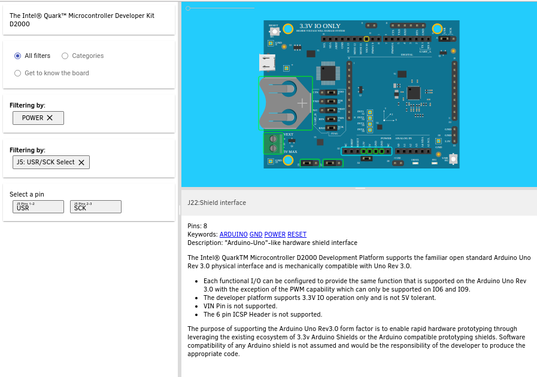

# Board Explorer

Copyright (C) 2016-2017 Intel Corporation

[Live demo!](https://board-explorer.github.io/board-explorer/#quark_mcu_dev_kit_d2000)




# License

| License    | Components                                           |
|:-----------|:-----------------------------------------------------|
| Apache 2.0 | Front-end application and components                 |
| CC-BY-4.0  | boards/* including documentation and graphics        |


## Overview

The Board Explorer is:

1. An interactive visualization and documentation explorer
2. A JSON schema for describing hardware boards
3. A convention used when naming elements in an SVG to allow the JSON data to
   be visualized to the user with the board explorer

The Board Explorer application is written using [Polymer](https://polymer-project.org).

The project uses the [board-viewer](https://github.com/board-explorer/board-viewer) element, which is responsible for parsing
an SVG, JSON data file, and translating associated documentation for
presentation. Stand alone applications can use the `board-viewer` element
independent of the Board Explorer application.


### Minimal prerequisites

```bash
sudo apt-get install nodejs nodejs-legacy npm
sudo npm install -g bower
```

**NOTE**: If you will want to build and host a minified version of the board-explorer,
you will need polymer command line tools, which require NodeJS >= 6.x (See [Polymer 
node-support](https://www.polymer-project.org/2.0/docs/tools/node-support).)

See [Polymer CLI](https://www.polymer-project.org/2.0/docs/tools/polymer-cli) for instructions
on installing the Polymer CLI.


## Installation

```bash
git clone https://github.com/board-explorer/board-explorer.git
```

You then need to install the web components used by the project and node
dependencies:

```bash
cd board-explorer
bower install
```

## Hosting a single board

To host a single board, the board needs to be declared in the boards.json file.

Once declared there, change the "singleBoard" property in 
src/board-explorer/board-explorer.html to be set to the board's "board" 
name (which is an alias for the directory holding the board contents.)

For example, if you have the following:

```bash
ls boards/
quark_mcu_dev_kit_d2000
```

In boards.json, you would have:

```json
{
  "title": "The Intel® Quark™ Microcontroller Developer Kit D2000",
  "board": "quark_mcu_dev_kit_d2000",
  "image": "front.svg"
}
```

Then you would change "singleBoard" to the following:

```text
      ...
      singleBoard: {
        type: String,
        value: "quark_mcu_dev_kit_d2000" /* replace with board-name for single board explorer */
      },
      ...
```


## Running

There are two ways to host the project.

1. Using `polymer serve`
2. Using a webserver and hosting a built version of the site


### Using `polymer serve`

To host using the Polymer CLI, you only need to run:

```bash
polymer serve
```

and it will create a local server to host the content. Internally it will
fixup all of the paths to route correctly.


### Using a webserver

The easiest way to host the project using a webserver is to use `polymer build` 
and then either point your webserver to the build/default directory or recursively
copy that directory to where you want it.

For example:

```bash
polymer build &&
  rsync -avprl defult/build/ /var/www/board-explorer/
```

The above will build the web application (which vulanizes and minimizes the HTML and JS)
and on success, it will then resurisvely copy the results to the /var/www/board-explorer/

If you want to host a non-build version of the site, you need to add a `<base>`
tag to the beginning of index.html

For example, to host the project from **/random-path**, you would add a `<base>` tag
prior to any other resources being loaded, as seen in this snippet:

```html
   ...
   <title>board-explorer</title>
   <meta name="description" content="board-explorer description">

   <base href='/random-path/'>
   ...
```


### Publishing a new live version

Whenever there is a new version to put on the live demo page hosted by GitHub, the
the following sequence is run:

NOTE: If there is a new board-viewer, the following will tag and publish a
new version of the board-viewer component:

```bash
cd board-viewer
./tag-release.sh
# Note the version number
./publish.sh
cd ..
```

Next, edit the board-explorer entry in `bower.json` to reference the latest version
of the board-viewer, and install it:

```bash
cd board-explorer

# Update the board-viewer version in board-explorer (assumes board-viewer is in ../board-viewer)
VERSION=$(git --git-dir=../board-viewer/.git tag | sort -rV | head -n 1)
sed -ie "s,board-explorer/board-viewer#^[^\"]*,board-explorer/board-viewer#^${VERSION},g" bower.json
bower install # Install the latest board-viewer

# Test the board-explorer to make sure it works correctly with latest version
# polymer serve
# ...

# Commit and push the version change to GitHub
git diff # Verify the only change is the version string
git commit -s bower.json -m "Updated board-viewer to ${VERSION}"
git push origin master

# Build and publish the live site
./build.sh
./publish.sh
```
